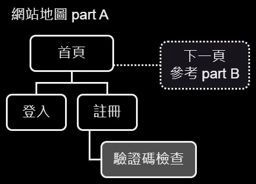
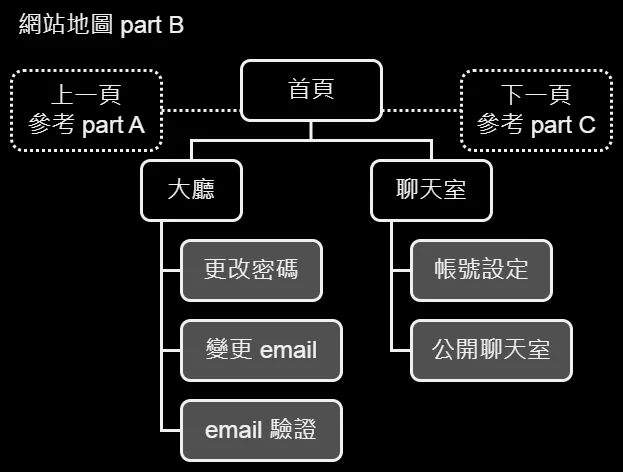
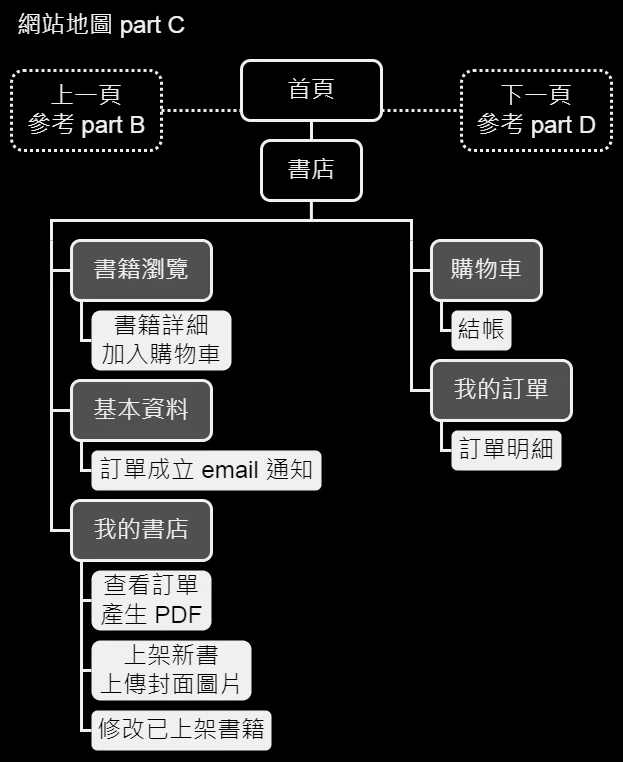
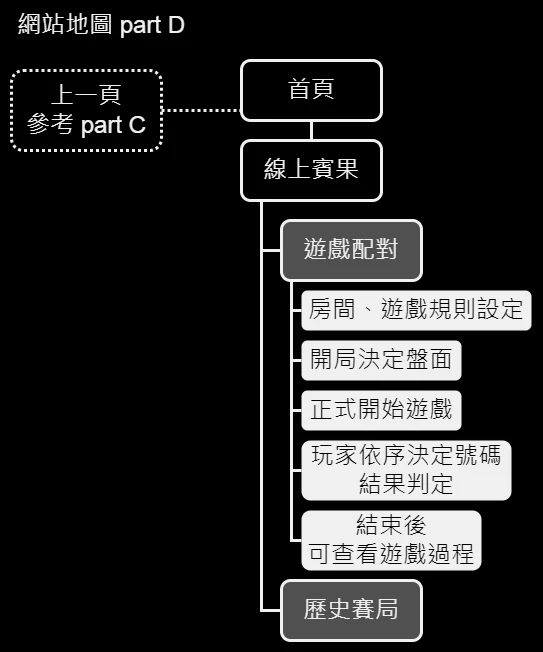

# mcn &middot; 

[網站連結](https://mcn.sytes.net/)

[賓果遊戲 demo &#91; YouTube 連結 &#93;](https://www.youtube.com/watch?v=fDWZ6i602ms)

[email 收信、新增書籍、購物車、查看訂單 pdf、聊天室 demo
 &#91; YouTube 連結 &#93;](https://www.youtube.com/watch?v=8mVKRml16-I)

PHP 實作聊天室、購物車、線上 bingo 連線遊戲 

## 網站地圖
[網站地圖 完整版](./docs/site_maps/mcn_site_map_full.drawio.webp)

## 伺服器環境
採用 LAMP 環境 Linux (Debian)、Apache、MySQL (MariaDB)、PHP 

前後端分離架構

前端相關程式碼 source/html

後端相關程式碼 source/websecure

## PHP 相關 package
使用 PHP composer 管理 package 
使用到的 package 有 JWT 與 TCPDF 

### 設定微軟正黑體
在 Linux 主機上，安裝好 TCPDF package 以後 
進入目錄 
`/var/php_packages/vendor/tecnickcom/tcpdf/tools/` 
將 res/font/ 裡的 msjh.ttf 與 msjhbd.ttf 複製到該目錄 

執行指令 
`php tcpdf_addfont.php -i msjh.ttf` 
`php tcpdf_addfont.php -i msjhbd.ttf` 

若成功，在目錄 `/var/php_packages/vendor/tecnickcom/tcpdf/fonts`  會發現新增了以下檔案： 
`msjhbd.ctg.z` 
`msjhbd.php` 
`msjhbd.z` 
`msjh.ctg.z` 
`msjh.php` 
`msjh.z` 

之後就能在 PHP 程式碼上，指定使用「微軟正黑體」印在 PDF 檔。

## License
[MIT License](./License)